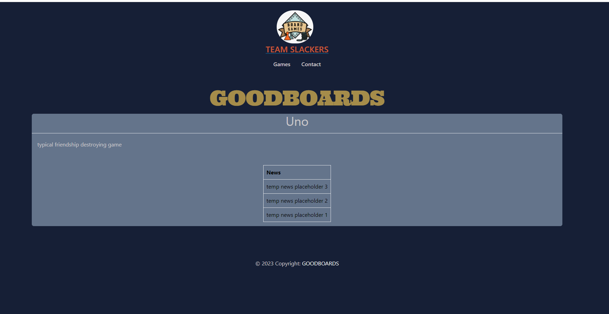
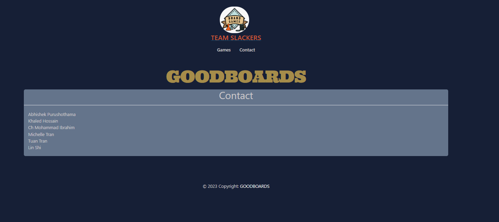

# Design

## Applications
Both due to the requirement for the course and it's compatibility to the goal we have three major components.
* Web Application
* Data Analyzer
* Data Collector

## Games Page

## Game Detail Page

## Contact Page 

## Description
The current Goodboards contains two tabs: Games and Contact. Contact will display the list of all authors. Games will display a list of all games stored. 
Then when clicking on each game, the detail page will appear with the game name, its descriptions, and a news section.

## Routes
- /games: Lists game information and news
- /contact: Lists Contact information about developers
- /game/{id}: Display the individual game description and news. 

## API
- Calling NewsAPI for news, using https://newsapi.org/v2/everything?q=board_games&apiKey=. Then the list of news are displayed in Game Detail page. 

## News Retrieval
`Collector` will use news service APIs to retrieve news information and submit this into a `queue`.

`Analyzer` will collate the news instances from said queue, and persist it in the database with the required relational constraints.

## Database
We are using a Postgres database. Some key design decisions:
- Our database is named `goodboards`, and all tables are defined under a single schema `goodboards`.
- Tables:
  - `games` - contains all game data. Tracks UUID, name, and description of the game
  - `news` - contains all news data per game retrieved from the database. Tracks the ID, title, and description of each news article.
- Only one connection to the database exists at any point. The connection is defined as a Singleton.

Read more [here](database.md).
